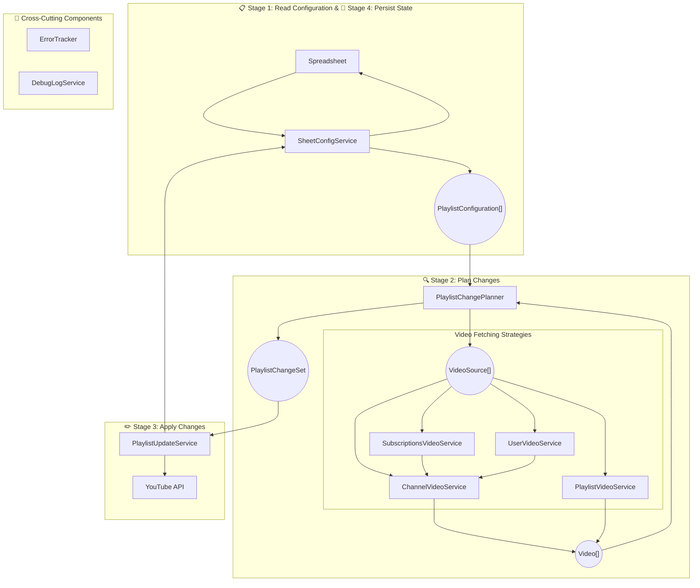

# Refactor sheetScript.ts into Model & Service Architecture

## Architecture Summary

**Current state:** The main `updatePlaylists()` function reads sheet data, directly calls YouTube and Spreadsheet APIs in multiple nested loops, passes raw strings and arrays between functions, and has error handling and logging scattered throughout.

**New state:** A cleanly layered architecture with explicit **domain models** (PlaylistConfiguration, Video, VideoSource, PlaylistChangeSet) that flow through four distinct **stages**: (1) read configs from sheet, (2) plan changes per config, (3) apply changes to YouTube, (4) persist updated state. External logic is moved into focused **service classes** that own specific responsibilities:

- **SheetConfigService**: Read/write playlist configuration and state
- **VideoFetchService strategy implementations**: `ChannelVideoService` (core), `SubscriptionsVideoService` (decorator), `UserVideoService` (decorator), `PlaylistVideoService`
  - Key pattern: Subscriptions and username resolution are **thin decorators** that delegate to a shared `ChannelVideoService`, eliminating code duplication for the core "fetch videos from a channel" logic
- **PlaylistUpdateService**: Add/remove videos from playlists
- **DebugLogService**: All debug logging and sheet writes
- **ErrorTracker**: Continues to accumulate errors (unchanged interface)

All external behavior (API calls, timestamps, error handling, debug output, quota management) remains identical; the refactor is purely structural—moving from a monolithic function with mixed concerns to a composition of focused, testable components that maintain the existing observable behavior.

## Scope and Goals

- **In-scope:** Only behavior currently implemented in [src/server/sheetScript.ts](src/server/sheetScript.ts) and described as "current implemented features" in [docs/web-app-feature-specification.md](docs/web-app-feature-specification.md).
- **Out-of-scope:** Requested / future features and any behavior not already present in the code (filters, templates, advanced web app flows, etc.).
- **Goals:**
  - Introduce explicit **domain model classes** instead of passing around raw strings and arrays (e.g., `PlaylistConfiguration`, `Video`, `PlaylistChangeSet`).
  - Introduce **service classes** for clear responsibilities (e.g., `SubscriptionsVideoService`, `UserVideoService`, `ChannelVideoService`, `PlaylistUpdateService`, `DebugLogService`, `SheetConfigService`).
  - Reorganize the main flow into four explicit stages: configuration creation, change computation, change application, state persistence.
  - Preserve external behavior (playlist updates, timestamps, debug logs, error semantics), allowing only internal ordering refactors where behavior is unchanged from the user’s perspective.

## High-Level Architecture

---

- **Models:** Represent concrete concepts (configuration for one playlist row, a video with metadata, a list of sources, the set of changes to apply).
- **Services:** Encapsulate Google APIs and spreadsheet access; main orchestration code composes these services instead of calling raw APIs directly.
- **Video-fetch decorators:** `SubscriptionsVideoService` and `UserVideoService` are two **decorators** on top of `ChannelVideoService`. Each adds a layer of functionality (subscription aggregation or username resolution) and then delegates to a linked `ChannelVideoService` instance to fetch videos; the core channel-video logic lives only in `ChannelVideoService`.

## Tasks

### Task 1: Introduce Domain Model Classes

- **1.1 Define playlist configuration model**
  - Create a `PlaylistConfiguration` class representing the data for a single playlist row (one entry in the main sheet):
    - `playlistId` (string, from column A).
    - `lastTimestamp` (`Date`, from column B) — timestamps are now `Date` objects internally; the sheet stores ISO 8601 strings which are converted on read.
    - `frequencyHours` (number | null, from column C).
    - `deleteDays` (number | null, from column D).
    - `sources` (typed collection of channel/user/playlist/subscriptions sources, based on columns from `reservedTableColumns` onward).
  - Ensure this model matches exactly what the existing loop in `updatePlaylists` currently reads from `data[iRow][...]`, without introducing new meaning.
  - Timestamp is stored as a `Date` object in this model; the sheet I/O boundary (`SheetConfigService`) handles conversion to/from ISO 8601 strings using the existing `dateToIsoString()` helper.
- **1.2 Define video and video source models**
  - Introduce a lightweight `Video` model to replace raw `string` IDs when representing videos.
    - At minimum, hold `id: string` (YouTube video ID), and optionally an origin enum (`"channel" | "playlist" | "subscription"`) **only if this can be derived directly from the current logic**.
  - Define a `VideoSource` hierarchy to model different types of inputs currently encoded as strings in channel columns:
    - `ChannelSource` for direct channel ID inputs (`UC...`).
    - `UsernameSource` for username-based channels (resolved via `YouTube.Channels.list` with `forUsername`).
    - `SubscriptionSource` representing the `ALL` keyword (uses `getAllChannelIds`).
    - `PlaylistSource` for mirroring playlists (`PL...`).
  - Ensure all logic for distinguishing these types reuses the same rules currently in the `for` loop over `iColumn` in `updatePlaylists` and does **not** introduce new heuristics.
  - Treat `VideoSource` + a corresponding `VideoFetchService` implementation as a **Strategy pattern** pair: each `VideoSource` type selects a matching strategy object that knows how to fetch `Video[]` for that source, while the orchestrator works only with the shared interface.
- **1.3 Define playlist item and playlist change set models**
  - Introduce a `PlaylistItem` model to represent specific playlist entries that can be deleted:
    - `id: string` (playlist item ID used by `YouTube.PlaylistItems.remove`).
    - `videoId: string` (underlying video ID).
    - Optionally `addedAtIso?: string` and/or `videoPublishedAtIso?: string` **only if these timestamps are already available from current API responses**, without adding extra API calls.
  - Create a `PlaylistChangeSet` model that encapsulates the result of computing what should happen to a playlist in a single run:
    - `videosToAdd: Video[]`.
    - `playlistItemsToDelete: PlaylistItem[]` (the concrete playlist items to remove, computed using the existing deletion logic).
  - Include metadata that is already implicit in the script, as long as it is derivable without new behavior (e.g., counts, but not new flags).
  - This model should be used as the handoff between the “compute changes” stage and the “apply changes” stage.
- **1.4 Align ErrorTracker usage with models**
  - Continue using the existing `ErrorTracker` class for error accumulation but adjust its methods to accept/produce model instances where that improves clarity (e.g., pass `PlaylistConfiguration` or `VideoId` instead of bare strings, as long as this does not change message texts or when errors are raised).
  - Ensure that all existing error messages remain the same, including wording and conditions for when they are added, to preserve observable behavior.

### Task 2: Introduce Services for External Interactions

- **2.1 Sheet configuration service**
  - Implement a `SheetConfigService` responsible for reading and writing configuration and state for each playlist row from the spreadsheet.
    - Methods like `getAllPlaylistConfigs(): PlaylistConfiguration[]` and `updateLastTimestamp(config: PlaylistConfiguration, newTimestamp: Date): void`.
    - Encapsulate low-level calls to `SpreadsheetApp`, `getDataRange().getValues()`, and `sheet.getRange(...).setValue(...)`.
    - Handle I/O boundary conversion: read ISO strings from sheet and convert to `Date`; write `Date` objects back to sheet as ISO strings via `dateToIsoString()`.
  - Ensure this service mirrors the current behavior of `updatePlaylists` around:
    - Row range (`reservedTableRows` onward).
    - Skipping rows with empty `playlistId`.
    - Initial timestamp creation when missing (24 hours back from now).
- **2.2 SubscriptionsVideoService (decorator over ChannelVideoService)**
  - Implement `SubscriptionsVideoService` as a **decorator** that wraps a `ChannelVideoService` instance.
  - It implements `VideoFetchService`: for a `SubscriptionSource`, it first calls the existing `getAllChannelIds` logic (paging tokens and loop unchanged) to obtain subscribed channel IDs, then for each channel ID delegates to the linked `ChannelVideoService.getVideos(...)` and aggregates the resulting `Video[]`.
  - Keep log messages and error conditions unchanged. The service adds the “subscriptions” layer (which channels to consider) and delegates the actual video fetching to `ChannelVideoService`.
- **2.2.1 UserVideoService (decorator over ChannelVideoService)**
  - Implement `UserVideoService` as a **decorator** that wraps a `ChannelVideoService` instance.
  - It implements `VideoFetchService`: for a `UsernameSource`, it resolves the username to a channel ID (e.g., via `YouTube.Channels.list` with `forUsername`), then delegates to the linked `ChannelVideoService.getVideos(...)` with that channel ID.
  - All core channel-video logic (timestamp filtering, pagination, error handling) stays in `ChannelVideoService`; `UserVideoService` only adds the username-to-channel resolution step before delegating.
- **2.3 Common interface for video-fetching services**
  - Define a common interface for all services that fetch videos to add, for example:
    - `interface VideoFetchService { getVideos(input: { source: VideoSource; lastTimestamp: Date }, errorTracker: ErrorTracker): Video[] }`.
    - Note: Timestamps are `Date` objects internally; conversion to ISO strings for YouTube API calls happens within each service implementation.
  - Ensure that, although implementations differ (subscriptions, channels, playlists), they all follow this shared shape, so orchestration can use a single process for obtaining `Video[]` from any `VideoSource`.
- **2.3.1 Strategy pattern for VideoSource → VideoFetchService (decorators and core)**
  - Implement the **Strategy pattern** by mapping each `VideoSource` variant to a `VideoFetchService` implementation. Two of these are **decorators** over `ChannelVideoService`:
    - `SubscriptionSource` → **SubscriptionsVideoService** (decorator): implements `VideoFetchService`; uses `getAllChannelIds` to get channel IDs, then for each channel calls the linked `ChannelVideoService.getVideos(...)` and aggregates results.
    - `UsernameSource` → **UserVideoService** (decorator): implements `VideoFetchService`; resolves username to channel ID, then calls the linked `ChannelVideoService.getVideos(...)`.
    - `ChannelSource` → **ChannelVideoService** (core): implements `VideoFetchService` directly for channel IDs.
    - `PlaylistSource` → **PlaylistVideoService**: implements `VideoFetchService` (no decorator; distinct API).
  - In the orchestrator (`PlaylistChangePlanner`), use only the `VideoSource` type to select the correct strategy and call `getVideos(...)`, without special-casing YouTube API details.
- **2.4 ChannelVideoService (core) and decorators**
  - Create **ChannelVideoService** as the **core** service that encapsulates:
    - `getVideoIdsWithLessQueries(channelId: string, lastTimestamp: Date, errorTracker: ErrorTracker): Video[]` (and optionally the unused `getVideoIds` method, still marked as unused but grouped for clarity).
    - Internally converts `lastTimestamp: Date` to ISO string via `dateToIsoString()` when calling YouTube API with `publishedAfter` parameter.
    - Uses `lastTimestamp.getTime()` for date comparisons within the pagination loop.
  - It implements `VideoFetchService` for `ChannelSource` (direct channel ID). It is also the **delegate** used by the decorators:
    - **SubscriptionsVideoService** holds a reference to a `ChannelVideoService` and delegates per-channel video fetching to it after obtaining channel IDs from subscriptions.
    - **UserVideoService** holds a reference to a `ChannelVideoService` and delegates to it after resolving a username to a channel ID.
  - Create **PlaylistVideoService** (separate from the decorator chain) wrapping `getPlaylistVideoIds(playlistId: string, lastTimestamp: Date, errorTracker: ErrorTracker): Video[]`.
    - Internally converts `lastTimestamp: Date` to ISO string via `dateToIsoString()` when calling YouTube API.
  - All of `ChannelVideoService`, `SubscriptionsVideoService`, `UserVideoService`, and `PlaylistVideoService` implement the shared `VideoFetchService` interface so they can be used interchangeably by the planner as strategies for different `VideoSource` types.
  - These services should:
    - Accept model types where appropriate (e.g., `ChannelSource` → channel ID string), but not change which API calls are made or how results are filtered.
    - Preserve the current rules on timestamp comparison and error checking.
- **2.5 Playlist service for add/delete operations**
  - Turn `addVideosToPlaylist` and `deletePlaylistItems` into methods of a `PlaylistUpdateService` class.
  - Interface examples:
    - `addVideos(playlistId: string, videos: Video[], errorTracker: ErrorTracker): void`.
    - `deleteItems(items: PlaylistItem[], errorTracker: ErrorTracker): void`.
  - Internally, reuse the exact `YouTube.PlaylistItems.insert` and `.remove` calls, including all current error handling branches, private/duplicate handling, and duplicate-removal logic.
- **2.6 Debug log service**
  - Group debug-related functions into a `DebugLogService` (or similar) class:
    - `getNextDebugCol`, `getNextDebugRow`, `clearDebugCol`, `initDebugEntry`, `loadLastDebugLog`, and `getLogs`.
  - Provide high-level methods like:
    - `beginExecutionLog(spreadsheet): { debugSheet, debugViewerSheet, nextDebugCol, nextDebugRow }`.
    - `writeExecutionLogs(...)` for writing per-row logs.
    - `finalizeExecutionLog(...)` for writing end-of-run messages.
  - Ensure that the layout of `DebugData` and `Debug` sheets, as well as all formulas and values, remain unchanged.

### Task 3: Restructure the Main Flow into Four Explicit Stages

- **3.1 Stage 1 – Build configurations from sheet**
  - Refactor `updatePlaylists` to delegate configuration building to `SheetConfigService` and `PlaylistConfigFactory`:
    - Replace manual reading of `data[iRow][...]` with building a `PlaylistConfiguration` per row.
    - Encapsulate channel-column parsing (including `ALL`, `UC...`, `PL...`, and username rules) into a dedicated helper or factory that produces a list of `VideoSource` instances.
  - Continue to use the same skipping logic for rows where `playlistId` is missing.
- **3.2 Stage 2 – Compute changes per configuration**
  - Introduce a `PlaylistChangePlanner` (or similar) responsible for:
    - Checking if it is time to update based on `frequencyHours` and `lastTimestamp` (same `MILLIS_PER_HOUR` logic and thresholds).
    - For each `VideoSource` type, calling the appropriate `VideoFetchService` implementation (`SubscriptionsVideoService`, `UserVideoService`, `ChannelVideoService`, `PlaylistVideoService`) via the common `getVideos(...)` interface to gather `Video[]`.
    - Aggregating the results into a `PlaylistChangeSet` object.
    - When `deleteDays` is set, computing which `PlaylistItem` instances should be deleted by:
      - Computing the cutoff `Date` as `new Date(Date.now() - daysBack * MILLIS_PER_DAY)` and delegating to `PlaylistUpdateService` or `deletePlaylistItems()`.
      - Querying the playlist as in the existing `deletePlaylistItems` implementation.
      - Building a `playlistItemsToDelete: PlaylistItem[]` using the same rules for age and duplicate detection as today.
  - Preserve the current handling of:
    - Logging when no new videos are found (controlled by `DEBUG_FLAG_LOG_WHEN_NO_NEW_VIDEOS_FOUND`).
    - Error accumulation via `ErrorTracker`, including when invalid channels or playlists are encountered.
- **3.3 Stage 3 – Apply changes to playlists**
  - Update `updatePlaylists` to, for each `PlaylistConfiguration`, either:
    - Skip the playlist if frequency says "not time yet", or
    - Invoke `PlaylistUpdateService` with the `PlaylistChangeSet`.
  - Ensure `DEBUG_FLAG_DONT_UPDATE_PLAYLISTS` still gates all write operations to YouTube **in the orchestration layer**:
    - When the flag is set, skip calling the playlist-modifying methods and instead log or record debug information consistent with current behavior.
    - When the flag is not set, call `PlaylistUpdateService.addVideos(...)` and `PlaylistUpdateService.deleteItems(...)` using the `videosToAdd` and `playlistItemsToDelete` from the `PlaylistChangeSet`.
  - Keep all quota checks (e.g., `MAX_VIDEO_COUNT`) and error semantics the same, but move them inside `PlaylistUpdateService` methods.
- **3.4 Stage 4 – Persist state and finish logging**
  - Use **SheetConfigService** to persist state: extend or use it to handle updating `lastTimestamp` when there are no errors and the timestamp debug flag is not set (no separate `SheetStatePersister` class).
  - Centralize the logic that currently lives at the end of `updatePlaylists` for:
    - Writing per-row logs to `DebugData`.
    - Writing the final overall success/failure message.
    - Deciding whether to throw an error when `errorTracker.getTotalErrorCount() > 0`.
  - Ensure the order in which logs are written, and the conditions for throwing the final error, remain identical to the existing implementation.

### Task 4: Preserve Public Interfaces and Integrations

- **4.1 Keep exported functions behavior-compatible**
  - Maintain the signatures and externally-visible behavior of:
    - `updatePlaylists(...)`.
    - `doGet(e)`.
    - `playlist(pl, sheetID)`.
    - `getLogs(timestamp)`.
  - Refactor `doGet` minimally to use new services where appropriate (e.g., for `updatePlaylists` invocation), but do not change query parameter semantics (`update=True`, `pl=N`) or HTML template variables.
- **4.2 Maintain global constants and flags**
  - Keep global constants like `MAX_VIDEO_COUNT`, `reservedTableRows`, and the debug flags where they are or move them into a configuration module, but do not change their values or meaning.
  - If moving them, provide a single import path that `sheetScript.ts` uses, to avoid duplicating configuration logic.
- **4.3 Keep Apps Script and YouTube API usage unchanged in effect**
  - Ensure that the scopes, API methods, and parameters used for YouTube and Spreadsheet operations remain the same.
  - Avoid adding new API calls or changing existing ones in ways that would impact quota or behavior (e.g., don’t start requesting new `part` fields or extra reads) as part of this refactor.

### Task 5: Incremental Migration Strategy

- **5.1 Introduce models and services alongside existing code**
  - Initially, create model and service classes in the same module or in new modules imported by `sheetScript.ts`, while leaving the old top-level functions intact.
  - Gradually switch `updatePlaylists` and other exported functions to call the new abstractions internally.
  - Verify after each step that behavior (logs, debug data, timestamps, and playlist changes) matches the current implementation for representative scenarios.
- **5.2 Phase out direct helper function calls**
  - Once services are fully wired, deprecate free-standing helper functions (`getAllChannelIds`, `getVideoIdsWithLessQueries`, `getPlaylistVideoIds`, debug functions) in favor of methods on their respective service classes.
  - Optionally keep thin wrappers that delegate to the services for a transition period, if that makes diff review clearer, before fully removing them.
- **5.3 Add lightweight tests or scriptable checks where feasible**
  - Where possible within the current Apps Script/TypeScript environment, add small tests or scripted checks for the new model and service classes (e.g., pure functions for parsing a row into `PlaylistConfiguration`, or for deciding whether it is time to update based on timestamps and frequency), without introducing a full new test framework if that is not already present.
  - Focus these checks on ensuring that the refactor preserves:
    - Frequency calculations.
    - Timestamp initialization and updates.
    - Channel/playlist/username/ALL parsing rules.

### Discussion Areas

- **D1. Degree of type richness in models**
  - **Option A:** Keep models minimal (e.g., `VideoId` only wraps a `string`) to reduce refactor risk and avoid accidental behavior changes.
  - **Option B:** Enrich models with additional fields available from current API responses (e.g., publish date) as long as they are already fetched today.
  - **Trade-off:** Option A is safer in the short term; Option B may better support future filter features but risks being perceived as new behavior or requiring extra API calls.
  - **Decision:** Use Option A for the initial refactor (minimal `Video` and `PlaylistItem` models), but design them so they can be extended later without changing existing behavior.
- **D2. Location of ErrorTracker responsibility**
  - **Option A:** Keep `ErrorTracker` as a shared dependency passed into all services, as currently done in function form.
  - **Option B:** Give each service its own internal error tracker and aggregate results at the orchestrator level.
  - **Constraint:** Since the current script uses a single `ErrorTracker` instance per overall run, Option A more closely matches existing semantics (particularly for total error counts and per-playlist counts).
  - **Decision:** Use Option A; maintain a single shared `ErrorTracker` instance passed through orchestration and services.
- **D3. Granularity of services vs. single YouTube service**
  - **Option A:** Separate `SubscriptionsVideoService`, `UserVideoService`, `ChannelVideoService`, `PlaylistVideoService`, and `PlaylistUpdateService` as distinct classes. `SubscriptionsVideoService` and `UserVideoService` are **decorators** on top of `ChannelVideoService` (they add a layer of functionality and delegate to a linked `ChannelVideoService`).
  - **Option B:** Combine all YouTube interactions into a single `YouTubeService` with multiple methods.
  - **Trade-off:** Option A better reflects the current functional decomposition and keeps a single place for channel-video logic (`ChannelVideoService`) while subscriptions and username handling are thin decorators; Option B reduces the number of classes but may lead to a large, less cohesive service.
  - **Decision:** Use Option A, and additionally require that all video-fetching services (`SubscriptionsVideoService`, `UserVideoService`, `ChannelVideoService`, `PlaylistVideoService`) implement the shared `VideoFetchService` interface for a common call pattern.
- **D4. Where to enforce debug flags**
  - **Option A:** Check debug flags in orchestration layer (e.g., `updatePlaylists`) before invoking service methods that perform writes.
  - **Option B:** Encapsulate the flags inside relevant services (e.g., `PlaylistUpdateService` checks `DEBUG_FLAG_DONT_UPDATE_PLAYLISTS`).
  - **Constraint:** Behavior must remain identical; whichever approach is taken, ensure flags are evaluated at the same points relative to logging and error accumulation as in the current implementation.
  - **Decision:** Use Option A; enforce debug flags (especially `DEBUG_FLAG_DONT_UPDATE_PLAYLISTS` and `DEBUG_FLAG_DONT_UPDATE_TIMESTAMP`) in the main orchestration flow before invoking services that perform writes.

